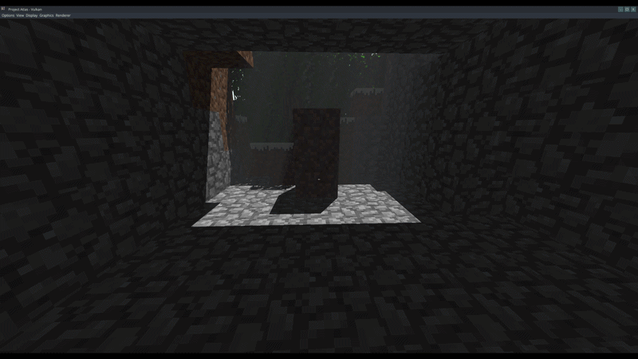
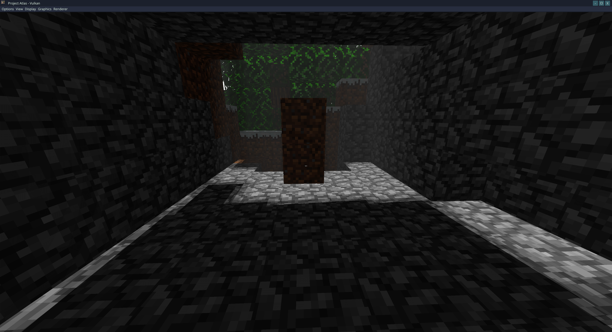
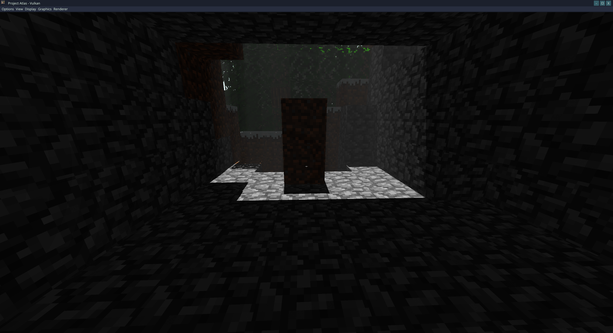
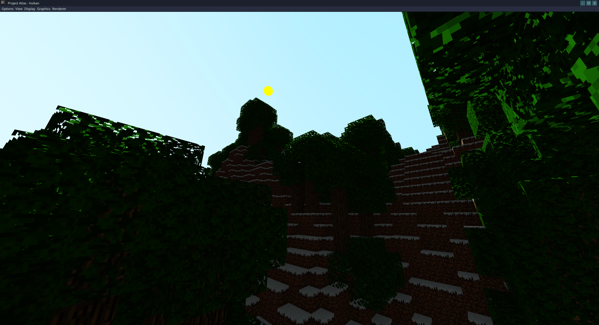
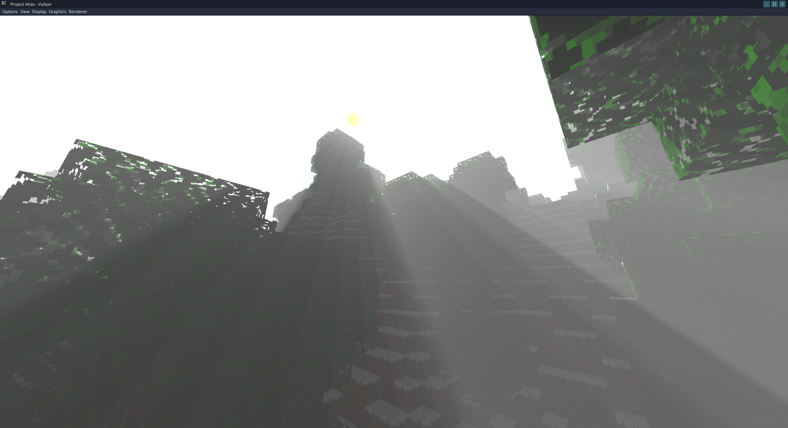

# Project Scorpio
C++20 voxel rendering engine built for Windows featuring a dual backend architecture supporting Vulkan 1.4 (hpp + Unique, Dynamic Rendering) and OpenGL 4.6 Core. Uses custom rendering pipelines in Vulkan to support traditional graphics, ray-tracing, and compute pipelines.

<h3>
Features:
</h3>

- Ray Traced Ambient Occlusion (RTAO), RT Shadows, and RT Reflections
- Ray Tracing Shader Support (Raygen, Miss, Closest-Hit, Any-Hit)
- Compute Shader Support
- Volumetric Fog + God Rays (Compute Shaders)
- Directional Shadow Mapping with Percentage-Closer Filtering (PCF)
- Physically-Inspired Surface Water Rendering
- Screen-Space Ambient Occlusion (SSAO)
- Fast Approximate Anti-Aliasing (FXAA)
- Camera View Frustum Culling
- Greedy Meshing for Chunks
- Memory-Efficient Vertex Storage
- Procedural Terrain Generation using LibNoise
- Block Placement and Destruction
- World Data Persistence:
    - Auto-Saving World State
    - Manual Save System

## Controls
- WASD – Move
- Mouse – Free-look camera (when in camera mode)
- Left Click – Break block
- Right Click – Place block

#### Input Modes
> **Note:** The application starts in camera control mode by default.
- **`=`** — Enable camera control mode
  - Allows free-look camera movement (mouse + keyboard).
- **`-`** — Enable cursor mode
  - Releases the mouse cursor for interaction with UI.

<h2>
Preview
</h2>




<!--  -->
<h2>
Debugging & Validation
</h2>

- Vulkan: Implemented system to assign debug names (for command buffers, descriptor sets, pipelines, and textures loaded from disk or created for color/depth attachments) to help identify critical passes of engine inside of RenderDoc and NVIDIA Nsight Graphics, and validation layers.
- OpenGL: Enabled debug context for immediate feedback relating to improper use of API, performance warnings, and undefined behavior.
- Used RenderDoc and NVIDIA Nsight Graphics to capture and analyze GPU frames across both Vulkan and OpenGL backends, verifying correctness of multi-pass rendering.
- Developed a custom in-engine debug system to visualize pass output textures, enabling real-time validation outside of frame captures.

<h2>
Rendering & Engine Techniques
</h2>

> Vulkan: Multi frame-in-flight architecture with per-frame resources (descriptor sets, UBOs) to avoid CPU-GPU synchronization hazards.

This project focuses on implementing real-time rendering techniques that are commonly used in modern game engines. The techniques were implemented from scratch with explicit control over GPU resources and pipeline state.

### Rendering Pipeline Overview
> Vulkan backend utilizes dynamic rendering, and hybrid rendering approach combining rasterization and ray tracing.

Vulkan:
1. G-buffer pass (normals + depth)
1. RT pass (TLAS/BLAS build/rebuild)
1. RTAO pass
1. RT Shadow pass
1. Shadow Map pass (shadow map depth)
1. SSAO pass
1. Water pass (reflection/refraction)
1. Debug pass (visualize pass outputs)
1. Forward render
1. RT render
1. Hybrid Composite Pass (rasterization + RT components combined)
1. Volumetric Fog Pass
1. God Rays Pass
1. Post Composite Pass (post-process + scene combined)
1. FXAA pass
1. Present Pass (final frame)
1. UI Elements (UI added to final frame)

OpenGL:
1. G-buffer pass (normals + depth)
1. Shadow Map pass (shadow map depth)
1. SSAO pass
1. Water pass (reflection/refraction)
1. Debug pass (visualize pass outputs)
1. Forward render (rasterization)
1. Volumetric Fog Pass
1. God Rays Pass
1. Post Composite Pass (post-process + scene combined)
1. FXAA Pass
1. Present Pass (final frame)
1. UI Elements (UI added to final frame)

<!--  -->
---
<h4>
Physically-Inspired Surface Water Rendering
</h4>

- Water is rendered using a dedicated pass that captures the scene above and below the water plane into reflection and refraction textures.
- Utilizes Fresnel-based reflection/refraction blending.
- DuDv mapping for wave distortion effects coupled with time-based animation.
- Refraction depth texture used to make shallow water appear lighter in color.

**Importance:**  
Previous versions of the engine rendered water as flat textured surfaces with limited visual fidelity. Water is now more visually appealing and takes into account other objects in the scene.

<!--  -->
---
<h4>
Screen-Space Volumetric Fog + God Rays
</h4>

- Screen-space, depth-based fog applied as a post-processing pass.
- Ray marching is performed from the camera through the depth-reconstructed scene to accumulate volumetric lighting and fog density.
- Utilizes a shadow map to generate volumetric light shafts (god rays).
- Integrates seamlessly with other post-processing effects like FXAA.

**Importance:**  
Demonstrates the ability to implement additional post-processing effects that integrate cleanly into an existing post-processing pipeline.

<!--  -->
---
<h4>
Screen-Space Ambient Occlusion (SSAO)
</h4>

- Utilizes a G-buffer that stores view space normals and depth.
- Generates a random sample kernel in view space and projects samples into screen space.
- Calculates occlusion by comparing sampled depth values against the current fragment depth.
- A blur pass is applied to reduce high frequency noise while preserving edge detail.

**Importance:**  
SSAO adds depth perception and contact shadows without the cost of full global illumination, significantly improving visual realism in dense voxel environments.

<!--  -->
---
<h4>
Fast Approximate Anti-Aliasing (FXAA)
</h4>

- Implements FXAA 3.11 by Timothy Lottes  
  (based on https://gist.github.com/kosua20/0c506b81b3812ac900048059d2383126)
- A post-processing pass that operates on the final scene color buffer.
- Identifies and smooths jagged edges.

**Importance:**  
FXAA is a cost-efficient method for anti-aliasing with minimal performance cost that is ideal for voxel engines.

<!--  -->
---
<h4>
View Frustum Culling
</h4>


- Each chunk is tested against the camera's view frustum using Axis-Aligned Bounding Box (AABB) vs frustum plane checks. 
- Only the chunks visible from inside the frustum are rendered.
- Integrated directly into the chunk manager (CPU side) to avoid extra GPU load through draw calls.
- Noticeable performance increase from 679 FPS to 1057 FPS (~56% improvement) measured on an RTX 5090 at the same camera position.

**Importance:**  
Frustum culling drastically reduces GPU workload by efficiently rendering only the chunks visible in camera view, reducing overhead and increasing performance as the world grows in size.

<!--  -->
---
<h4>
Greedy Meshing
</h4>

- The chunk mesh is generated using greedy meshing, which scans each chunk in three passes (one per axis).
- For each pass, adjacent voxels are compared to detect visible faces. Adjacent faces that match in attributes are merged into larger quads.

| GPU            | Optimizations Off (FPS) | Optimizations On (FPS) | FPS Change | % Increase |
|----------------|---------------|--------------|------------|----------|
| Intel Arc A370M      | 39.9          | 73.8          | +33.9       | +85.0%   |
| AMD Radeon 780M       | 39.3           | 90.7          | +51.4       | +130.8%   |
| Nvidia RTX 4060m       | 103.0           | 210.1          | +107.1       | +104.0%   |
| Nvidia RTX 5090       | 342.2           | 662.0          | +319.8        | +93.5%   |

**Importance:**  
Greedy meshing reduces the number of draw calls and triangles sent to the GPU, improving overall rendering performance.

<!--  -->
---
<h4>
Memory-Efficient Vertex Storage
</h4>


- Significantly reduced the per-vertex memory footprint for opaque geometry.
- Previously, each vertex stored position (vec3), normal (vec3), and UV (vec2) totaling 32 bytes. The optimized format packs this data into a single uint32_t (4 bytes).
- ~88% reduction in RAM usage: 1579 MB -> 185 MB.
- ~14% reduction in VRAM usage: 5282 MB -> 4526 MB.

> **Note:** VRAM reduction is smaller than RAM reduction due to textures and framebuffers dominating total GPU memory usage.

**Importance:**  
Smaller vertices reduce CPU memory pressure, improve cache efficiency, and allow significantly larger worlds and higher chunk counts without exhausting system memory.

<!--  -->
---
<h4>
Procedural Terrain Generation
</h4>

- Utilizes the LibNoise library to generate a terrain heightmap.
- This allows for varied terrain features such as hills, oceans, and trees.

**Importance:**  
Procedural generation allows for large, varied worlds without having to worry about doing so by hand, while maintaining a deterministic state.

<!--  -->
---
<h4>
World State Persistence System
</h4>

- Chunk data is serialized to disk using a custom save format.
- Supports both manual and automatic saving.
- As the player modifies (place/destroy blocks) the world, these changes persist through application shutdown and restart.

**Importance:**  
Persistent world state demonstrates data-oriented design beyond real-time rendering.

---
<!--  -->
<h4>
Directional Shadow Mapping
</h4>

- Implemented real-time directional shadow mapping using a light-space depth pass.
- Every frame the shadow map is re-calculated based on the camera's visible region.
- Applied Percentage-Closer Filtering (PCF) to produce softer shadows by sampling the surrounding texels of the depth map and averaging the results.

**Importance:**  
Adds depth cues and spatial realism while demonstrating understanding of multi-pass rendering, and real-time lighting techniques.

---

<!--  -->
<h4>
Custom Compute Pipeline
</h4>

- Implemented custom pipeline for compute work with compute shaders.
- Volumetric fog and god rays were implemented using compute shaders with workgroup-based parallel execution.

**Importance:**  
Demonstrates understanding of compute-driven rendering workflows and how compute pipelines differ from traditional rasterization.

---

<!--  -->
<h4>
Custom Ray Tracing Pipeline
</h4>

- Implemented systems for creation of bottom/top layer acceleration structure (BLAS/TLAS) for world.
- Helper class for shader binding table (SBT) to group RT shaders (raygen, miss, closest-hit, any-hit) together.
- Ray-traced world pipeline supports RTAO, RT shadows, and RT reflections using Vulkan acceleration structures (TLAS/BLAS).

**Importance:**  
Demonstrates understanding of the three major GPU rendering pipelines: rasterization, compute, and ray tracing.

---

<!--  -->
<h2>
Milestones
</h2>

| Terrain Generation + Skybox |
|---------|
| *Initial terrain generation using a simple heightmap.* |
| |

| Terrain Generation w/LibNoise |
|---------|
| *Terrain generation using LibNoise for more interesting views, trees are WIP.* |
| |

| Proper Tree Generation |
|---------|
| *Updated tree generation to randomly construct canopy.* |
| |

| G-buffer Normal | G-buffer Depth |
|----------------------------|--------------------------------|
| *Implemented G-buffer with debug view for surface normals.* | *Implemented G-buffer with debug view for depth.* |
|  |  |

| SSAO (Off) | SSAO (On) |
|----------------------------|--------------------------------|
| *Previous version of engine before implementation of SSAO.* | *SSAO significantly improves scene depth by enhancing contact shadows at the intersections where blocks meet. This improves perceived geometric detail and depth.* |
|  |  |

| Frustum Culling (Off) | Frustum Culling (On) |
|----------------------------|--------------------------------|
| *FPS: 679* | *FPS: 1057* = ~56% Increase in performance|
|  |  | 
|  |  | 

| FXAA (Off) | FXAA (On) |
|----------------------------|--------------------------------|
| *FXAA is turned off. The edges of the white cube are jagged.* | *FXAA helps to smooth out the jagged edges of objects in view. The white cube displays edges that have been noticeably smoothed.* |
|  |  | 
 |  |

| Flat Water | Enhanced Water |
|----------------------------|--------------------------------|
| *Previous version of engine using static water textures.* | *Enhanced water using reflection/refraction textures, and DuDv distortion.* |
|  |  |

| Fog (Off) | Fog (On) |
|----------------------------|--------------------------------|
| *World rendered without fog enabled.* | *Post-processing fog used to obscure objects further away.* |
|  |  |

| Optimizations (Off) | Optimizations (On) |
|----------------------------|--------------------------------|
| *World rendered without frustum culling, vertex memory reduction, and greedy meshing.* | *World rendered WITH frustum culling, vertex memory reduction, and greedy meshing.* |
| *FPS: 342* | *FPS: 662 = ~94%  Increase in Performance* |
| |*~88% reduction in RAM usage: 1579 MB -> 185 MB.* |
|  |  |
|  |  |

| OpenGL Render | Vulkan Render |
|----------------------------|--------------------------------|
| *Scene rendered in OpenGL.* | *Scene rendered in Vulkan.* |
|  |  |

| Shadow Mapping (Off) | Shadow Mapping (On) |
|----------------------------|--------------------------------|
|  |  |

| Rasterized Shadow Mapping | RT Shadows |
|----------------------------|--------------------------------|
|  |  |

| Volumetric Fog + God Rays (Off) | Volumetric Fog + God Rays (On) |
|----------------------------|--------------------------------|
|  |  |

| Traditional Rasterization | Ray Tracing |
|----------------------------|--------------------------------|
| *Scene rendered with SSAO, shadow mapping, reflection/refraction textures for water.* | *Scene rendered with RTAO, RT shadows, RT reflections.* |
|  |  |

<h2>
Requirements
</h2>

> - [Download](https://www.python.org/downloads/) and install latest version of Python.
> - [Download](https://git-scm.com/install/) and install Git.
> - [Download](https://vulkan.lunarg.com/sdk/home) and install latest Vulkan SDK.
> - [Download](https://visualstudio.microsoft.com/vs/community/) Visual Studio 2022 Community Edition or newer.
> -- Install workloads: *Desktop development with C++*.
> - [Download](https://cmake.org/download/) and install CMake (>= v3.31.0).

<h2>
Build
</h2>

- Clone repo:
```
git clone https://github.com/RobRob7/ProjectScorpio.git
```
- Then run commands:
```
cd ProjectScorpio
cmake --preset release
cmake --build --preset release
```
<h2>
Run
</h2>

- Git Bash:
```
./build/release/Scorpio
```

- Command Prompt:

```
build\release\Scorpio.exe
```


<h2>
Dependencies
</h2>

Libraries already provided, the following are used:
|Library|Usage|Version|
|-------|-------|-----|
|[Glad](https://glad.dav1d.de/)|OpenGL loader generator|N/A|
|[GLFW](https://www.glfw.org/download.html)|API for creating windows, contexts and surfaces, receiving input and events|v3.4|
|[GLM](https://github.com/g-truc/glm/releases/tag/1.0.1)|Header only C++ mathematics library|v1.01|
|[ImGui](https://github.com/ocornut/imgui/releases/tag/v1.92.5)|Bloat-free Graphical User interface for C++|v1.92.5|
|[LibNoise](https://libnoise.sourceforge.net/)|A portable, open-source, coherent noise-generating library for C++|v1.0.0|

<h2>
Project Structure
</h2>

Project layout:
- **include/**
  - internal header files
- **src/**
    - main.cpp → main driver
    - **chunk/**
        - **opengl/**
            - chunk_mesh_gpu_gl.cpp → chunk mesh opengl
        - **vulkan/**
            - chunk_mesh_gpu_vk.cpp → chunk mesh vulkan
        - chunk_data.cpp → chunk data
        - chunk_manager.cpp → management of chunk meshes
        - chunk_mesh.cpp → chunk mesh
    - **core/**
        - application.cpp → main application
        - scene.cpp → object setup + renderer call opengl
        - scene_vk.cpp → object setup + renderer call vulkan
    - **light/**
        - light.cpp → light cube object opengl
        - light_vk.cpp → light cube object vulkan
    - **main_opengl/**
        - opengl_main.cpp → opengl main instance
    - **main_vulkan/**
        - acceleration_structure_vk.cpp → TLAS/BLAS creation
        - buffer_vk.cpp → buffer helper class
        - compute_pipeline_vk.cpp → compute pipeline helper class
        - descriptor_set_vk.cpp → descriptor set helper class
        - graphics_pipeline_vk.cpp → rasterization pipeline helper class
        - ray_tracing_pipeline_vk.cpp → ray-tracing pipeline helper class
        - shader_binding_table_vk.cpp → SBT creation helper class
        - vulkan_main.cpp → vulkan main instance
    - **player/**
        - crosshair.cpp → crosshair UI icon opengl
        - crosshair_vk.cpp → crosshair UI icon vulkan
    - **renderer/**
        - **opengl/**
            - chunk_pass_gl.cpp → opaque chunk render
            - debug_pass.cpp → G-buffer normal + depth view
            - fog_pass_gl.cpp → fog pass
            - fxaa_pass.cpp → FXAA pass
            - gbuffer_pass.cpp → G-buffer pass
            - god_ray_pass_gl.cpp → God Ray pass
            - post_composite_pass_gl.cpp → fog + scene combine pass
            - present_pass.cpp → final image pass
            - renderer_gl.cpp → main render loop
            - shadow_map_pass_gl.cpp → shadow map pass
            - ssao_pass.cpp → SSAO pass
            - water_pass.cpp → water pass
        - **vulkan/**
            - **raytracing/**
                - ray_tracing_world_pass_vk.cpp → opaque + water RT render
                - ray_tracing_world_vk.cpp → opaque + water RT TLAS/BLAS build
                - rtao_pass_vk.cpp → RTAO pass
            - chunk_pass_vk.cpp → opaque chunk render
            - debug_pass_vk.cpp → G-buffer normal + depth view
            - fog_pass_vk.cpp → fog pass
            - fxaa_pass_vk.cpp → FXAA pass
            - gbuffer_pass_vk.cpp → G-buffer pass
            - god_ray_pass_vk.cpp → God Ray pass 
            - hybrid_composite_pass_vk.cpp → Rasterization + RT combine pass 
            - post_composite_pass_vk.cpp → fog + scene combine pass
            - present_pass_vk.cpp → final image pass
            - renderer_vk.cpp → main render loop
            - shadow_map_pass_vk.cpp → shadow map pass
            - ssao_pass_vk.cpp → SSAO pass
            - water_pass_vk.cpp → water pass
    - **save/**
        - save.cpp → world state saving
    - **system/**
        - camera.cpp → camera system
    - **ui/**
        - ui.cpp → UI system
    - **utility/**
        - **opengl/**
            - compute_shader_gl.cpp → compute shader helper
            - cubemap_gl.cpp → setup + render cubemap
            - shader.cpp → rasterization shader helper
            - texture.cpp → setup texture
            - ubo_gl.cpp → UBO buffer
        - **vulkan/**
            - compute_shader_vk.cpp → compute shader helper
            - cubemap_vk.cpp → setup + render cubemap
            - image_vk.cpp → texture base
            - shader_vk.cpp → rasterization shader helper
            - texture_2d_vk.cpp → load texture from file
            - texture_cubemap_vk.cpp → load multiple textures from file
            - utils_vk.cpp → transition image helpers
- **res/**
  - **shader/** → Shaders
  - **texture/** → Textures
- **deps/** → Dependency files
- **papers/** → Papers implemented
